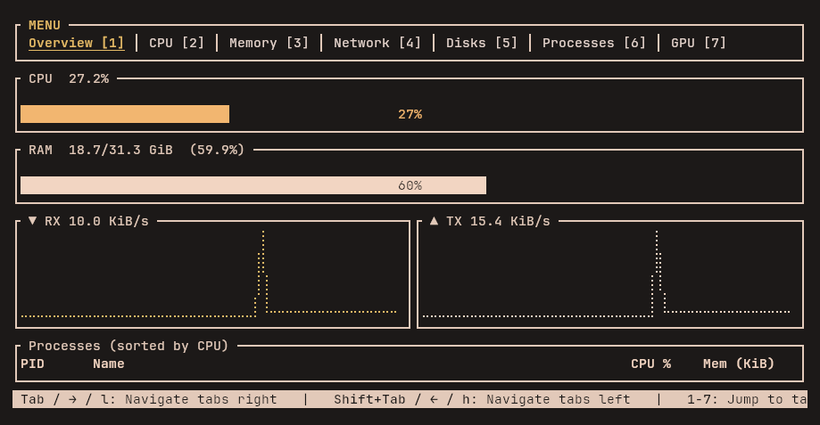

<div style="text-align: center;">
  <p style="display: inline-flex; align-items: center; gap: 15px; font-size:60pt;">
    
    Narsil
  </p>
</div>

> A terminal-based system resource monitor written in Rust — fast, readable, and GPU-aware.

Named after the reforged sword of Aragorn, **narsil** is built to be sharper than the tools that came before it. It targets developers and power users who live in the terminal and need real-time system insight without leaving it.

---

## 📸 Screenshot



---

## ✨ Features

### Current scope (v0.1)

| Tab | What you see |
|-----|-------------|
| 🗺️ **Overview** | CPU gauge, RAM gauge, live RX/TX sparklines, top processes (fills available height) |
| 🧠 **CPU** | Global usage history chart (Braille), per-core gauges with colour-coded load |
| 💾 **Memory** | RAM + Swap history charts, GiB usage gauges |
| 🌐 **Network** | Combined RX/TX history chart, per-direction current throughput |
| 💿 **Disks** | Per-partition usage bars at fixed height, scrollable when partitions exceed the terminal |
| 🔬 **Processes** | Process table sorted by CPU, scrollable, fills available height |
| 🎮 **GPU** | Per-GPU cards with utilisation + VRAM history charts, gauges, temperature and power draw |

### 🔑 Key behaviours

- 🎨 **Split-colour gauges** — the percentage label rendered inside every gauge automatically inverts its colour character-by-character at the fill boundary so it is always readable, even when the bar is exactly at 50%.
- 📜 **Scroll indicators** — any panel that cannot display all items at once shows `▲`/`▼`/`▲▼` in its title.
- 📐 **Dynamic sizing** — all panels adapt to the current terminal dimensions; no hard-coded row counts.
- ⚡ **1-second refresh** driven by a tick loop; key events are processed between ticks with zero busy-waiting.
- ⌨️ **Keyboard-first navigation**: `Tab` / `Shift+Tab` wrap-around tab switching; `1`–`7` direct jump; `j`/`k` or arrow keys for scrolling; `q` or `Ctrl-C` to quit.
- 💬 **Status bar** — persistent one-line keybinding reference at the bottom, context-aware per tab.

---

## 🚀 Installation

### Prerequisites

- Rust toolchain ≥ 1.85 (`rustup update stable`)
- Linux kernel with standard `/sys` and `/proc` mounts

### Build (default — AMD / no dedicated GPU)

```bash
git clone <repo>
cd narsil
cargo build --release
./target/release/narsil
```

### Build with NVIDIA support 🟢

Requires NVIDIA proprietary drivers installed (NVML library must be present at link time).

```bash
cargo build --release --features nvidia
```

---

## 🎮 GPU support matrix

| Vendor | Driver | Detected | Utilisation | Memory | Temperature | Power |
|--------|--------|----------|-------------|--------|-------------|-------|
| 🔴 AMD discrete | `amdgpu` | ✅ | ✅ `gpu_busy_percent` | ✅ VRAM | ✅ hwmon | ✅ hwmon |
| 🔴 AMD iGPU (APU) | `amdgpu` | ✅ | ✅ | ⚠️ GTT (shared RAM) | ✅ | ✅ |
| 🟢 NVIDIA | proprietary + `--features nvidia` | ✅ | ✅ NVML | ✅ NVML | ✅ NVML | ✅ NVML |
| 🔵 Intel iGPU | `i915` / `xe` | ❌ | — | — | — | — |
| 🔵 Intel Arc discrete | `xe` | ❌ | — | — | — | — |

> ⚠️ **AMD APU note**: the VRAM figures reflect GTT memory (system RAM dynamically assigned to the GPU), not dedicated video memory. The values are accurate but on-screen labels will stay as "VRAM" until the display is updated in a future release.

> 🗓️ **Intel note**: Intel GPU support is planned — see Roadmap below.

---

## ⌨️ Keybindings

| Key | Action |
|-----|--------|
| `Tab` / `Shift+Tab` | Next / previous tab (wraps around) |
| `1` – `7` | Jump directly to tab |
| `→` / `l` | Next tab |
| `←` / `h` | Previous tab |
| `↓` / `j` | Scroll down (Disks, Processes, GPU tabs) |
| `↑` / `k` | Scroll up |
| `q` / `Ctrl-C` | Quit |

---

## 🏗️ Architecture

```
src/
├── main.rs      — terminal setup, raw-mode lifecycle, event + tick loop
├── app.rs       — App state, all metric refresh logic (CPU/RAM/Net/Disk/GPU)
└── ui.rs        — ratatui rendering: one function per tab + shared helpers
                   (SplitGauge custom widget lives here)
```

Data flows in one direction:

```
app.on_tick()  →  App (shared state)  →  ui::draw()  →  ratatui frame
```

There is no async runtime; `crossterm::event::poll` provides the non-blocking event check.

---

## 📦 Dependencies

| Crate | Purpose |
|-------|---------|
| `ratatui` | TUI layout and widget rendering |
| `crossterm` | Cross-platform terminal control, raw mode, event stream |
| `sysinfo` | CPU, RAM, swap, network, disk, process data |
| `anyhow` | Ergonomic error handling |
| `nvml-wrapper` *(optional)* | NVIDIA GPU metrics via NVML |

---

## 🗺️ Roadmap

Items are loosely ordered by priority.

### 🔜 Near-term

- 🔵 **Intel GPU support** — utilisation via GT frequency ratio (`i915`/`xe` sysfs), LMEM for Intel Arc cards, temperature via hwmon; shown with appropriate caveats for iGPUs
- 🏷️ **AMD APU label fix** — distinguish GTT (shared) from dedicated VRAM and label accordingly
- ⏱️ **Configurable refresh rate** — CLI flag `--interval <ms>` to tune between low-latency and low-CPU usage
- 🎨 **Colour themes** — built-in dark/light/high-contrast theme switcher

### 🔧 Medium-term

- 🔬 **Per-process GPU attribution** — show which processes hold GPU memory (via NVML or `fdinfo` on the DRM driver)
- 🌡️ **Temperature history charts** — per-core CPU and GPU temperature sparklines, not just current values
- 💨 **Fan speed** — hwmon fan RPM display in the GPU card and a new thermal overview section
- 🌐 **Network per-interface breakdown** — drill-down view listing each interface (eth0, wlan0, lo…) separately with its own sparkline
- 💽 **Disk I/O throughput** — read/write MB/s per device, not just partition usage percentages
- 🔋 **Battery / power panel** — laptop-focused: charge level, rate of charge/discharge, estimated time remaining

### 🚀 Long-term / differentiators

- 📋 **Log tail panel** — a dedicated tab that tails systemd journal or a user-specified log file in real time, with regex highlight rules; something `htop` and `gotop` completely lack
- 🚨 **Alert rules** — user-defined thresholds (e.g. CPU > 90% for > 5 s, VRAM > 80%) that flash the affected panel border red and optionally send a desktop or webhook notification
- 🔌 **Plugin / script hooks** — allow arbitrary shell scripts or Rust dynamic libraries to provide custom metric panels, making narsil extensible without a fork
- 📼 **Session recording & replay** — record a metric session to a compact binary file and replay it later for post-mortem analysis
- 🖥️ **SSH-aware remote mode** — connect to a remote host via SSH and display its metrics locally in the same TUI, without needing narsil installed on the remote
- 🖱️ **Mouse support** — click tabs and scroll panels with the mouse alongside the existing keyboard navigation
- 📊 **Export** — one-shot `--json` / `--prometheus` output mode for integration with external dashboards (Grafana etc.)

---

## ⚖️ Comparison with existing tools

| Feature | `top` | `htop` | `gotop` | **narsil** |
|---------|-------|--------|---------|-----------|
| Language | C | C | Go | 🦀 **Rust** |
| GPU metrics | ❌ | ❌ | partial | **✅ AMD + NVIDIA** |
| Braille charts | ❌ | ❌ | ✅ | **✅** |
| Per-char label inversion | ❌ | ❌ | ❌ | **✅** |
| Disk usage bars | ❌ | ❌ | ✅ | **✅** |
| Status bar with keybindings | ❌ | ❌ | ❌ | **✅** |
| Log tail panel | ❌ | ❌ | ❌ | 🗓️ planned |
| Alert rules | ❌ | ❌ | ❌ | 🗓️ planned |
| Remote mode | ❌ | ❌ | ❌ | 🗓️ planned |
| Session replay | ❌ | ❌ | ❌ | 🗓️ planned |

---

## 📄 License

GPL-3.0 — see [LICENSE](LICENSE).

